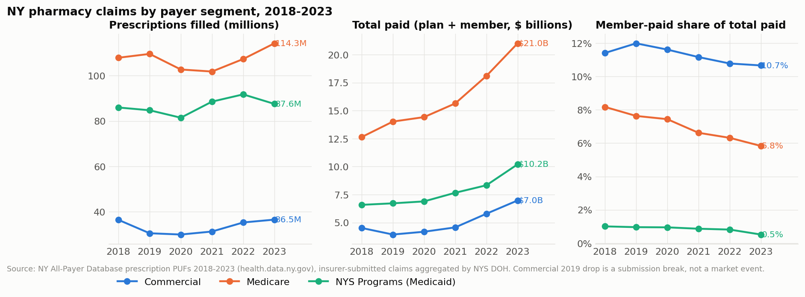
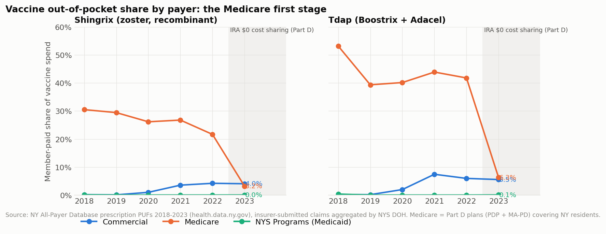
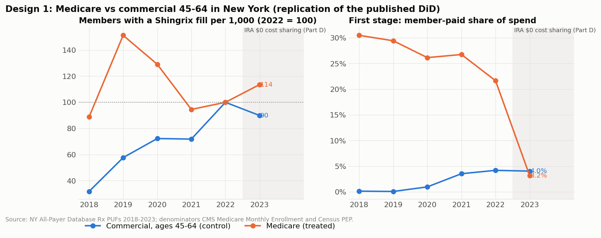
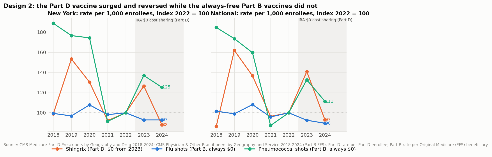
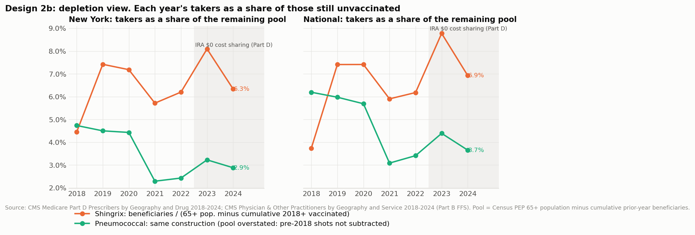
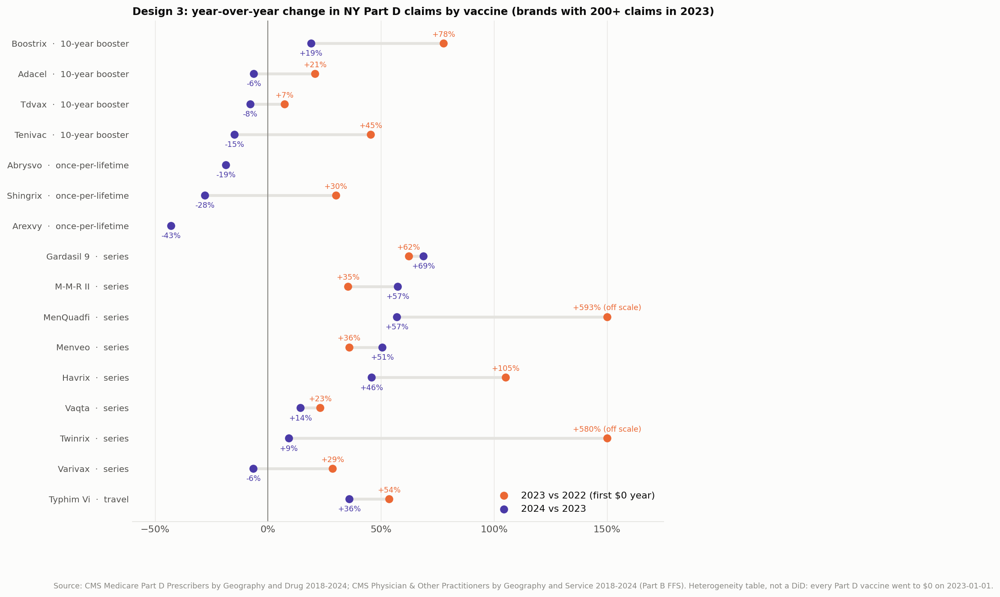
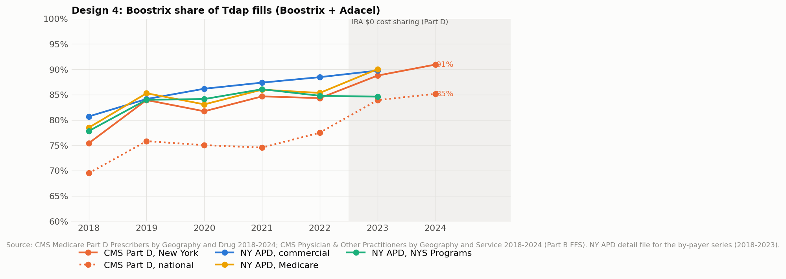
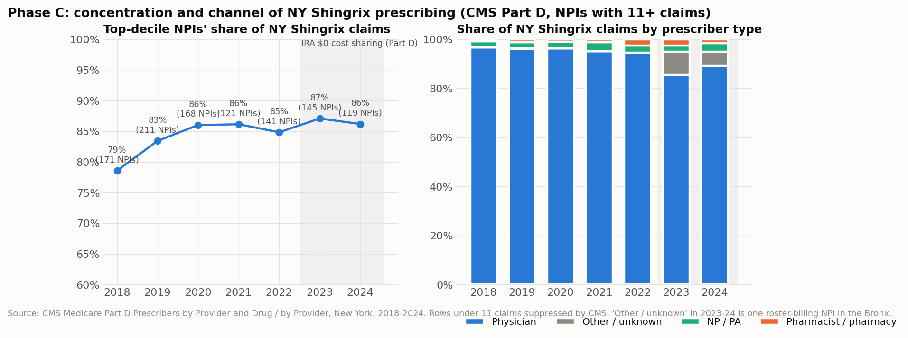
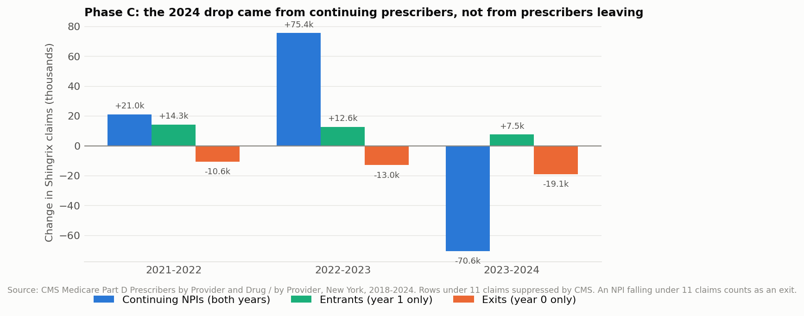

# NY pharmacy claims warehouse and the IRA vaccine cost-sharing study

A dbt + DuckDB warehouse over New York State's All-Payer Database (APD) prescription public-use files, 2018-2023, split into **commercial, Medicare, and Medicaid (NYS Programs)** segments, joined with CMS Medicare Part D and Part B public files (2018-2024) to answer one dated policy question:

> Did the Inflation Reduction Act's $0 cost sharing for Part D vaccines (effective 2023-01-01) raise uptake, and did it hold up against the 2024 decline?

Published work (a JAMA research letter on IQVIA data and an ASPE issue brief on Medicare claims) stops at 2023. This project replicates the Medicare-vs-commercial difference-in-differences on an independent public source, adds 2024, the cross-vaccine reversal pattern, the within-Medicare Part B comparison, and a prescriber layer.

Everything below is reproducible: `dbt build` runs 33 models and 125 tests; `analysis/readout.py` writes the 12 figures in `docs/` and `docs/headline_numbers.md`, which lists every number with the mart it came from.

---

## 1. What the data is, and what it is not

| Segment (APD `payer_type`) | What it is | What it is not |
|---|---|---|
| **COMMERCIAL** | Insurer-submitted pharmacy claims for fully insured and self-funded (ERISA) employer plans, individual and small-group plans, and employer retiree plans that are not Part D. 36.5M fills, $7.0B in 2023. | Not vendor data, not record-level, not patient-level. The 65+ slice is contaminated by switching into Medicare (65+ fills fell 22% in 2023 vs 13% for 45-64). |
| **MEDICARE** | Medicare drug plans covering NY residents: stand-alone Part D (PDP) and Medicare Advantage drug plans (MA-PD). 114.3M fills, $21.0B in 2023. | Part B drugs and vaccines (flu, pneumococcal, COVID-19) are medical claims and are not here. |
| **NYS PROGRAMS** | Medicaid fee-for-service and managed care, Child Health Plus, Essential Plan. 87.6M fills, $10.2B in 2023. | Not a usable 2023 control: the 2023-04-01 NYRx pharmacy carve-out drops vaccine rows about 75% (Shingrix 45,733 to 11,212). |

The APD publishes **aggregates**: one row per active ingredient x payer x year (summary file, ~5.4k rows) and one row per 9-digit NDC x payer x year (detail file, ~49k rows). There is no prescriber, no sub-state geography, no month, no patient, no dose number. "All-payer" means insurer-submitted claims of all three segments aggregated by the state.

What commercial-claims work this does demonstrate: payer segmentation of pharmacy claims; an NDC-9 / labeler / brand-generic drug dimension; plan-paid vs member-paid decomposition from sums; a control-group contamination check and age restriction; detail-to-summary reconciliation; documented data breaks.

**CMS files** (data.cms.gov): Part D Prescribers by Geography and Drug (national + state, 2018-2024); Physician & Other Practitioners by Geography and Service (Part B fee-for-service only, 2018-2024); Part D Prescribers by Provider and Drug and by Provider, New York rows only. Rows under 11 claims are suppressed by CMS. Prescriber ZIP is the practice location; pharmacy-administered vaccines carry pharmacist or pharmacy NPIs.

**Denominators**: CMS Medicare Monthly Enrollment (Part D enrollees, Original Medicare beneficiaries, NY and national, annual rows) and Census Population Estimates Program state age-by-sex files (civilian population 45-64, 50+, 65+). The Census API now requires a key, so the ACS employer-coverage count for ages 45-64 is optional (`CENSUS_API_KEY`); without it the commercial control is normalized by resident population 45-64.

## 2. The question and the published benchmarks

| Source | Design | Finding (as recorded in the build plan) |
|---|---|---|
| JAMA research letter, May 2024 (USC / Michigan, IQVIA NPA) | DiD, Medicare Part D vs commercial | Part D vaccine fills +46%, commercial -21% |
| ASPE HP-2024-09 (Medicare claims) | Pre/post vs 2021 | Shingles +42%, Tdap +114% |

Both stop at 2023. Both are national. Neither reports a pre-trend check.

## 3. Grain and keys

| Layer | Model | Grain / key |
|---|---|---|
| staging | `stg_apd_rx_summary` | year x payer x ingredient x therapeutic class (x `source_row_seq`; 59 rows in 2018-2020 repeat a key in the state's file) |
| staging | `stg_apd_rx_detail` | year x payer x NDC-9 (one suppressed `VARIOUS` row per payer-year) |
| staging | `stg_cms_partd_geo` | year x geography x brand x generic |
| staging | `stg_cms_phys_geo` | year x geography x HCPCS x place of service |
| staging | `stg_cms_partd_prescriber` / `_drug` | year x NPI / year x NPI x brand x generic (NY) |
| dims | `dim_payer`, `dim_drug_ndc9`, `dim_ingredient` | payer_type / ndc9 / nonproprietary_name |
| seeds | `vaccine_products`, `vaccine_hcpcs`, `ny_denominators`, `published_benchmarks` | product / hcpcs_cd / geo x year x measure |

## 4. The marts

**Phase A, NY APD (commercial-claims layer)**: `mart_payer_market` (year x payer), `mart_class_by_payer` (year x payer x class, with the commercial share of each class), `mart_brand_generic_by_payer`, `mart_labeler_commercial` (labelers ranked by commercial spend), `mart_vaccine_by_payer_year` (ingredient grain: fills, members, fills per member, OOP share, OOP per fill, age-band estimates), `mart_vaccine_brand_by_payer_year` (NDC-9 brand split), `mart_recon_apd_detail_vs_summary`.

**Phase B, the study**: `mart_study_did_replication` and `mart_study_did_estimates` (design 1), `mart_study_partd_vs_partb` and `_comparison` (design 2), `mart_study_cross_vaccine_reversal` (design 3), `mart_study_tdap_brand_share` (design 4), `mart_recon_apd_vs_cms_shingrix`, `mart_study_cost_share_residuals`.

**Phase C, prescriber layer (CMS, NY)**: `mart_vaccine_prescriber` (NPI x product x year with the prescriber's LIS / non-LIS, MAPD / PDP and dual mix), `mart_prescriber_deciles`, `mart_specialty_cut`, `mart_nyc_dose_response`, `mart_prescriber_attrition`, `mart_recon_cms_prescriber_vs_geo`.

## 5. Headline numbers

All numbers are in `docs/headline_numbers.md` with their mart. Figures are in `docs/`.

**Market (Phase A).** In 2023 the commercial segment filled 36.5M prescriptions for $7.0B with members paying 10.7% of the total; Medicare 114.3M and $21.0B at 5.8%; NYS Programs 87.6M and $10.2B at 0.5%. Commercial generics were 81% of fills and 12% of spend; brands 18% of fills and 85% of spend. AbbVie (11.5%), Novo Nordisk (7.8%), Janssen (6.3%), Lilly (6.1%) and Gilead (5.9%) led commercial spend. Member cost sharing is highest in central nervous system (27.9%) and cardiovascular (23.6%) classes.



**First stage.** Medicare members paid 21.7% of Shingrix spend in 2022 and 3.2% in 2023 ($34.5 to $4.41 per fill); for Tdap 41.8% to 6.3%. Commercial stayed near 4%; Medicaid near 0%.



**Design 1, replication (NY APD, `mart_study_did_estimates`).** Members with a Shingrix fill per 1,000 enrollees rose 13.5% for Medicare from 2022 to 2023 (58.8 to 66.7 per 1,000 Part D enrollees) and fell 10.1% for commercial members aged 45-64 (9.5 to 8.5 per 1,000 residents). The difference-in-differences is **+23.6 percentage points**, the same sign as the JAMA letter's +46 / -21 and about a third of its size; the outcome here is members, not fills, and the geography is one state. Using the 2021-2022 mean as the pre-period gives +12.1 points (members) and +25.1 points (fills). **The pre-trend check fails**: from 2018 to 2022 the commercial 45-64 rate tripled from a near-zero base (3.0 to 9.5 per 1,000) while Medicare peaked in 2019 and troughed in 2021, so the estimate rests on the single 2022-2023 contrast. The published papers did not run this check.



**Design 2, within Medicare (CMS, `mart_study_partd_vs_partb_comparison`).** In New York, Shingrix claims per 1,000 Part D enrollees went 78.6 (2022) to 99.5 (2023, +27%) to 69.2 (2024, -30%), ending 12% below 2022. Over the same years Part B flu administrations per 1,000 Original Medicare beneficiaries went 367 to 341 to 341 (-7%, then flat): the always-free comparator shows a modest fatigue trend and no surge or reversal. Pneumococcal administrations rose 34% in 2023 and fell 10% in 2024, driven by PCV20's 2021 launch, not by cost sharing. The event-study coefficient on the Shingrix-to-flu rate ratio is +36% in 2023 and -5% in 2024 relative to 2022 (national: +52%, +4%). Measured against the remaining pool (65+ population minus everyone vaccinated since 2018), NY Shingrix uptake went 6.2% to 8.1% to 6.3%: the 2023 surge took roughly two years of normal demand, and 2024 returned to the pre-policy pace.




**Design 3, cross-vaccine reversal (CMS NY Part D, `mart_study_cross_vaccine_reversal`).** The 2024 decline is specific to once-per-lifetime vaccines that surged in 2023: Shingrix +30% then -28%; Arexvy -43% and Abrysvo -19% in their second year (also hit by the June 2024 ACIP narrowing to 75+ and at-risk 60-74). The 10-year boosters split: Boostrix +78% then +19%, Adacel +21% then -6%, Tenivac +45% then -15%. Small-base series and travel vaccines kept growing in 2024 (Twinrix +580% then +9%, Havrix +105% then +46%, Gardasil 9 +62% then +69%, MenQuadfi +593% then +57%, Typhim Vi +54% then +36%). This is a heterogeneity table, not a DiD: every Part D vaccine went to $0 on the same day.



**Design 4, Boostrix vs Adacel (`mart_study_tdap_brand_share`).** Boostrix's share of NY Part D Tdap fills went 84.3% (2022) to 88.8% (2023) to 90.9% (2024); nationally 77.5% to 83.9% to 85.2%. The APD shows the same move inside Medicare (85.3% to 90.1%) and a flatter commercial series (88.5% to 89.8%). The $0 year favored the brand with no upper age limit on its label.



**Prescriber layer (Phase C, CMS NY).** Prescriber-level rows carry 90-94% of NY Shingrix claims each year. The top decile of NPIs writes 85-87% of claims. Physicians write 85-95% of Shingrix claims; pharmacists under 3%, which says the Part D prescriber field records the ordering clinician, not the administering pharmacy. One Bronx NPI typed "Student in an Organized Health Care Education/Training Program" (a roster-billing artifact) carries 27,467 claims in 2023 (9.5% of the state) and 12,018 in 2024. The 2023-2024 decline of 82k claims decomposes into continuing prescribers -70.6k, exits -19.1k, entrants +7.5k: the drop is demand at existing prescribers, not channel loss. The NYC dose-response design (2022 non-LIS share x post, NPI and year fixed effects) is not credible on these files: the zero-imputed panel has strong pre-trends because suppression removes small prescribers, and the balanced 119-NPI panel gives +0.51 (SE 0.27) in 2023 and -0.67 (SE 0.45) in 2024 log points per unit of non-LIS share, the right pattern without significance.




**Reconciliations.** APD Medicare Shingrix members and CMS NY Shingrix beneficiaries, two independent sources, agree within 8% every year (ratio 0.95-1.08). APD detail totals tie to summary totals within 0.01% for all 18 payer-years; 65% of ingredient rows reconcile within 0.5% and the rest run 0.5-1% low because NDC rows under 11 members are suppressed into one bucket (warn-level test, misses listed in `mart_recon_apd_detail_vs_summary`). Non-LIS cost sharing per claim is under $1 from 2023 for every ACIP-recommended Part D brand; residuals remain on Gardasil 9 ($4-7 per claim, use above 45 is off-recommendation) and Hep A ($0.06-1.11).

## 6. Data breaks found

1. **APD mean/median paid columns exclude $0 claims.** They rise after a $0 policy. All cost-sharing measures use the `sum_*` columns; a test (`assert_no_mean_paid_columns_in_marts`) fails the build if any mart exposes a mean or median paid column.
2. **2023 APD percentage columns are scaled 1/100** (every row sums to 0.01). Staging multiplies 2023 by 100; a test checks that age and sex shares sum to 1 on every row.
3. **NYRx carve-out, 2023-04-01.** NYS Programs vaccine rows drop about 75%; Medicaid is documented, not modeled, for 2023.
4. **Commercial 2019 submission drop.** Commercial fills fall 16% from 2018 to 2019 (36.4M to 30.5M) and recover by 2022; this is a reporting break, not a market event.
5. **CMS 2024 catalog title reads "2024-12-01"** where other years read "12-31". Verified full-year: eight flat-demand generics grew 0.5-9.2% in 2024, in line with 2023; total national claims +5.8%; catalog temporal coverage 2024-01-01 to 2024-12-31. A test fails if any of the eight falls more than 5%.
6. **Pharmacy roster billers are in the Part B provider file.** In NY 2023, Mass Immunizer Roster Biller, Centralized Flu, and Pharmacy NPIs account for 59% of flu administrations (G0008), and the provider file carries 97% of the geography-file total. Both files are usable for Part B vaccines.
7. **Duplicate keys in the APD summary.** 59 rows (2018-2020) repeat year x payer x ingredient x class; kept with a sequence number.
8. **Suppressed buckets.** APD detail has one no-NDC `VARIOUS` row per payer-year; CMS geography files have a few blank-geography rows (keyed `XX`); CMS prescriber rows under 11 claims do not exist.
9. **Census API requires a key** (keyless requests return "Missing Key"); population denominators come from the PEP CSV files instead.
10. **One roster-billing NPI** carries 9.5% of NY Shingrix claims in 2023 (see Phase C).

## 7. What a brand team would do next

- Re-run design 1 when the 2024 APD year is released, and add the 2025 CMS year (expected around May 2027) to the event study.
- Replace the population denominator for the commercial control with ACS employer-coverage counts (`CENSUS_API_KEY`), and the Shingrix remaining pool with a two-dose completion model.
- Use the Part D by-Provider file's PDP / MAPD split to test whether plan type moderated the surge.
- Tag the roster-billing NPIs through NPPES and re-run the attrition decomposition with them pooled.
- For a true patient-level answer (dose completion, switching, time-to-second-dose) this public layer is not enough; that needs licensed record-level claims.

## 8. How to run

```bash
python3 -m venv .venv && .venv/bin/pip install -r requirements.txt
export DBT_PROFILES_DIR=.
# raw downloads (gitignored): ~0.9 GB, 10-15 minutes
.venv/bin/python scripts/fetch_cms_prescribers.py      # NY prescriber rows via the data.cms.gov API
.venv/bin/python scripts/fetch_denominators.py         # seeds/ny_denominators.csv
# APD and CMS geography CSVs: see the URLs in BUILD-PLAN.md A0 / B0 and models/staging/*.sql; place under data/raw/
.venv/bin/dbt build                                    # 33 models, 4 seeds, 125 tests
.venv/bin/python analysis/readout.py                   # figures + docs/headline_numbers.md
# CI build on the committed 40 MB sample (what .github/workflows/dbt.yml runs)
.venv/bin/dbt build --target ci --vars '{"raw_dir": "data/sample"}'
```

`data/sample/` holds the six APD summary files, the 2018 and 2023 detail files, and NY + national CMS extracts for the vaccine brands, the eight flat-demand generics and the vaccine HCPCS codes, so the whole test suite runs in CI in under a minute (`scripts/make_samples.py` rebuilds it).

## 9. Repository layout

```
models/staging/       typed views over the raw CSVs (APD, CMS, denominators)
models/intermediate/  vaccine seed matched to APD ingredients and NDC-9s
models/marts/apd/     Phase A marts and dims
models/marts/study/   Phase B study marts
models/marts/prescriber/  Phase C marts
seeds/                vaccine_products, vaccine_hcpcs, ny_denominators, published_benchmarks
tests/                singular tests (reconciliations, guardrails, acceptance bands)
analysis/             readout.py, apd_readout.py, viz.py
scripts/              fetch_cms_prescribers.py, fetch_denominators.py, make_samples.py
docs/                 figures and headline_numbers.md
data/sample/          committed CI extracts (data/raw/ is gitignored)
```
